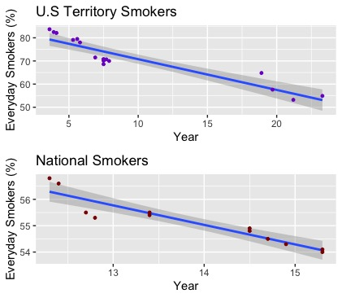

# Tobacco-Obesity-Rates

## Abstract
Many people believe smoking can help people lose weight. This perception is based off the fact that nicotine is an appetite suppressant, leading to young adults to start smoking in order to lose weight. This study is intended to explore the relationship between tobacco use and obesity.
Using multiple models in my experiment to analyze my data, primarily KNN algorithms and K-Means clustering. PCA analysis was a method I initially considered, but the dataset has low dimensions so it is not a necessary model. The primary focus was to see if obesity rates and tobacco use rates were correlated, however I additionally wanted to see if state smoking rates could be clustered by region, as well as by obesity rate ranks.
The data suggests that tobacco use can affect obesity rates, however believing that smoking protects against, or causes, obesity may be over-simplistic. Quitting smoking may be associated with temporary weight gain, but cannot be concluded to increase obesity rates.

## Introduction

The rules and regulations surrounding tobacco use in the United States are changing rapidly. Smoking increases the risk of cancer, respiratory diseases, and cardiovascular diseases. California raised the minimum age to purchase tobacco products to 21 on June 9th, 2016 as a measure to decrease tobacco use, and many states are set to follow. Most states see tobacco use as negative as it has been consistently proven to lead to major health problems.
Many smokers want to quit, but a small percentage actually attempt to. The most common reason people fail to quit is because of addiction, however there are other factors contributing to people’s inability to quit tobacco use. Weight gain concerns can be a very influential in tobacco use, as tobacco can be used as an appetite suppressant. This perception can be a reason that many people start smoking. Scientifically, tobacco use should lead to less weight gain. Nicotine activates pathways in the brain that suppress appetite, causing smokers to typically weight less than non-smokers.
The relationship between tobacco use and obesity rates is complicated, but possibly there is a strong correlation between the two. There is evidence that tobacco use can lead to weight gain, but also that quitting tobacco can lead to weight gain. Food begins to lose its taste after smoking for prolonged periods of time. The idea is that when one quits smoking, one will eat a lot more because of the heightened flavors. This is how I based my study. I wanted to see if an increase in number of former smokers increased obesity rates.
Obesity is also becoming a major public health challenge and its prevalence is increasing worldwide. The definition of obesity can vary, however the CDC defines obesity as having a BMI of 30+.
The tobacco use data I used was taken from a study done by the Center for Disease and Prevention. It consisted of 877 observations and 7 attributes. Detailing from 1995-2010, it included tobacco use percentages of U.S states and territories: former smokers, everyday smokers, non-smokers, and casual smokers. It also included a longitude/latitude coordinate for each state. I removed this column.
I merged the tobacco use data with a dataset compiled by the State of Obesity, a private organization dedicated to preventing obesity in the United States. This dataset included obesity rate percentages per state/territory from 2005-2010. I had to remove observations from the tobacco data set that were before 2005 so there were no blank values.
Additionally, I created two factor variables with the state and obesity rate variable for further exploring tobacco and obesity. My final data set consisted of 8 attributes and 335 observations.
All exploration and analysis was done with RStudio and its included libraries, and compilation of the data was done in Microsoft Excel.

## Exploration
The data required a full scale scrub and reformatting. I also created a brand new response variable called 'Obesity Rate', which sorted numerical obesity rates into 3 distinct ranks: 'Low', 'Medium', and 'High'.
```
#Create Obesity Rank Factor Variable
index <- tobacco$Obesity_Rate
sorted <-sort(index) # First sort the Obesity Rate Values
Obesity_Rank <- cut(sorted, breaks = 3,labels = FALSE) # Cut the sorted values into 3 different ranks

#Check the ranks
Obesity_Rank <- factor(Obesity_Rank, levels = 1:3,labels = c("Low","Medium","High"))

tobacco <- data.frame(Year, Region, State,  Obesity_Rate, Obesity_Rank, Everyday, Former, Never, Somedays)
```

I first wanted to see if former smoking rates affected obesity rates. My initial hypothesis was that previously smoking would lead to obesity. I explored the data visually.


Based on the data, a higher percentage of former smokers leads to a lower percentage of obesity rates. This is the opposite of what I expected when I initally began the study. This supports the hypothesis that tobacco use does prevent weight gain. A conclusion could be based just off of these graphs. However, I wanted to explore the data more.

I then began to think about how tobacco use effects smoking rates by region. I created subsets of the data based off regions of the United States:


