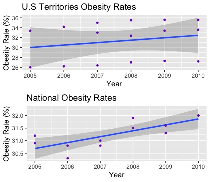
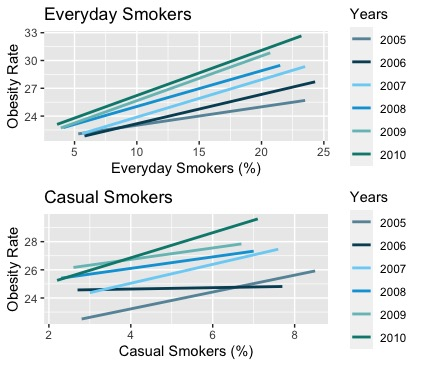
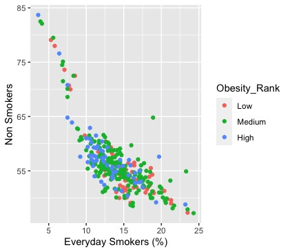
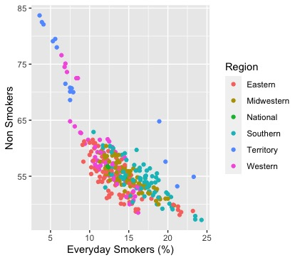
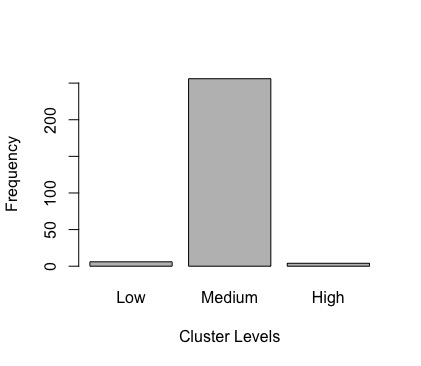

# A Study of Tobacco & Obesity-Rates

## Abstract
Many people believe smoking can help people lose weight. This perception is based off the fact that nicotine is an appetite suppressant, leading to young adults to start smoking in order to lose weight. This study is intended to explore the relationship between tobacco use and obesity.
Using multiple models in my experiment to analyze my data, primarily KNN algorithms and K-Means clustering. PCA analysis was a method I initially considered, but the dataset has low dimensions so it is not a necessary model. The primary focus was to see if obesity rates and tobacco use rates were correlated, however I additionally wanted to see if state smoking rates could be clustered by region, as well as by obesity rate ranks.
The data suggests that tobacco use can affect obesity rates, however believing that smoking protects against, or causes, obesity may be over-simplistic. Quitting smoking may be associated with temporary weight gain, but cannot be concluded to increase obesity rates.

## Introduction

The rules and regulations surrounding tobacco use in the United States are changing rapidly. Smoking increases the risk of cancer, respiratory diseases, and cardiovascular diseases. California raised the minimum age to purchase tobacco products to 21 on June 9th, 2016 as a measure to decrease tobacco use, and many states are set to follow. Most states see tobacco use as negative as it has been consistently proven to lead to major health problems.
Many smokers want to quit, but a small percentage actually attempt to. The most common reason people fail to quit is because of addiction, however there are other factors contributing to people’s inability to quit tobacco use. Weight gain concerns can be a very influential in tobacco use, as tobacco can be used as an appetite suppressant. This perception can be a reason that many people start smoking. Scientifically, tobacco use should lead to less weight gain. Nicotine activates pathways in the brain that suppress appetite, causing smokers to typically weight less than non-smokers.
The relationship between tobacco use and obesity rates is complicated, but possibly there is a strong correlation between the two. There is evidence that tobacco use can lead to weight gain, but also that quitting tobacco can lead to weight gain. Food begins to lose its taste after smoking for prolonged periods of time. The idea is that when one quits smoking, one will eat a lot more because of the heightened flavors. This is how I based my study. I wanted to see if an increase in number of former smokers increased obesity rates.
Obesity is also becoming a major public health challenge and its prevalence is increasing worldwide. The definition of obesity can vary, however the CDC defines obesity as having a BMI of 30+.
The tobacco use data I used was taken from a study done by the Center for Disease and Prevention. It consisted of 877 observations and 7 attributes. Detailing from 1995-2010, it included tobacco use percentages of U.S states and territories: former smokers, everyday smokers, non-smokers, and casual smokers. It also included a longitude/latitude coordinate for each state. I removed this column.
I merged the tobacco use data with a dataset compiled by the State of Obesity, a private organization dedicated to preventing obesity in the United States. This dataset included obesity rate percentages per state/territory from 2005-2010. I had to remove observations from the tobacco data set that were before 2005 so there were no blank values.
Additionally, I created two factor variables with the state and obesity rate variable for further exploring tobacco and obesity. My final data set consisted of 8 attributes and 335 observations.
All exploration and analysis was done with RStudio and its included libraries, and compilation of the data was done in Microsoft Excel.

## Exploration
The data required a full scale scrub and reformatting. I also created a brand new response variable called 'Obesity Rate', which sorted numerical obesity rates into 3 distinct ranks: 'Low', 'Medium', and 'High'.
```
#Create Obesity Rank Factor Variable
index <- tobacco$Obesity_Rate
sorted <-sort(index) # First sort the Obesity Rate Values
Obesity_Rank <- cut(sorted, breaks = 3,labels = FALSE) # Cut the sorted values into 3 different ranks

#Check the ranks
Obesity_Rank <- factor(Obesity_Rank, levels = 1:3,labels = c("Low","Medium","High"))

tobacco <- data.frame(Year, Region, State,  Obesity_Rate, Obesity_Rank, Everyday, Former, Never, Somedays)
```

I first wanted to see if former smoking rates affected obesity rates. My initial hypothesis was that previously smoking would lead to obesity. I explored the data visually.


Based on the data, a higher percentage of former smokers leads to a lower percentage of obesity rates. This is the opposite of what I expected when I initally began the study. This supports the hypothesis that tobacco use does prevent weight gain. A conclusion could be based just off of these graphs. However, I wanted to explore the data more.

I then began to think about how tobacco use effects smoking rates by region. I created subsets of the data based off regions of the United States:

  

For each region smoking rates are going down, and obesity rates are rising. This counters the hypothesis that smoking leads to weight loss. Perhaps these trends are correlated, however the relationship is much more complicated than initally observed.According to the organization Trust for America's Health, Obesity Rates have been constantly rising in the U.S and have doubled since 1980.

<p float="left">
  
   
</p>


The higher the percentage of former smokers, the lower the obesity rates. This denied my hypothesis that more former smokers would increase obesity rates. All of the yearly trends are consistent for each graph.

However, from 2005-2010, there is a positive correlation between percentage of everyday smokers and obesity rates. Unfortunately, there is also the same correlation between non-smokers and obesity rates. It is possible that the relationship is much more complicated than a direct correlation.

Additionally, obesity rates are rising consistently every year, while smoking rates are declining every year. 

## K-Means Clustering
Initially clustering seemed to not be a very effective technique, because the data is very linear. However, I realized I could sort the data effectively into different categories such as Region and Obesity Rank. I defined these factor variables manually. To create a ranking for obesity ranks, I equally seperated the values of obesity into 3 types: Low, Medium, and High. 

In order to create a region variable, I had to manually define every state as Western, Eastern, Midwestern, Southern, or U.S Territory. I chose these classification regions because I thought they would have similar attributes. 

```{r, echo=FALSE}
index <- tobacco$Obesity_Rate
sorted <-sort(index) # First sort the Crime Rate Values
Obesity_Rank <- cut(sorted, breaks = 3,labels = FALSE) # Cut the sorted values into 5 different ranks
Obesity_Rank<- factor(Obesity_Rank, levels = 1:3,labels = c("Low","Medium","High"))
tobacco <- data.frame(Year, Region, State, Obesity_Rate, Obesity_Rank, Everyday, Former, Never, Somedays)
```
<p float="left">
  
   
</p>

The "low" obesity rank sits in the top right corner with a high percentage of non-smokers and low percentage of everyday smokers. 

The "high" obesity rank sits in the bottom right with a high percentage of everyday smokers and a low percentage of non-smokers. 

The "medium" obesity rank sits somewhere in the middle of these.

This model suggest that high tobacco use leads to high obesity rates. 

Comparing the original plot to the k-means clustered plot, it clustered the 3 Obesity Ranks nicely, but was very different than than the original.

<p float="left">
  
   
</p>

This is the attempt to K-Means cluster by region. Unfortunately most of the regional data is very similar, so it can be difficult to cluster. However, it is easy to see that U.S territories have the lowest smoking rates, and the algorithm predicts it correctly.

## KNN Testing
The K-Means model proved to be very useful, however I wanted to try another classification algorithm to predict obesity rate. 

I established an 80% training data set and a 20% test data set and preformed the KNN leave-one-out-cross-validation method. 

I created a function to find a value for k that would minimize the error rate. The K that provided the lowest error rate was 21.

Here is the output for the LOOCV model with the lowest error rate:

```{r echo=FALSE, warning=FALSE}
train <- sample(1:nrow(tobacco)-1, 267) #Set up the data
tobacco.train <- tobacco[train,-(1:5)] #Remove year, state,and type variable for train data
tobacco.test <- tobacco[-train,-(1:5)] #Remove year, state, and type variable for test data
tobacco.trainLabels <- tobacco[train, 5]
tobacco.testLabels <- tobacco[-train, 5]

#LOOCV Test
set.seed(1)
error2 = NULL #Initialize error variable 
for (i in 1:(nrow(tobacco.train)-1)) #Create for loop to compute error rate for all values of K
{ 
  loocv1 <- knn.cv(train = tobacco.train, cl=tobacco.trainLabels, k=i, prob=FALSE, use.all=TRUE)
  error2[i] = mean(loocv1 != tobacco.trainLabels)
}
loocv<- knn.cv(train=tobacco.train, cl=tobacco.trainLabels, k=21, prob=FALSE, use.all=TRUE)
```
Unfortunately, the LOOCV method classifies most observations as having a "medium" obesity rate, with a very high error rate regardless of choice of k. This is most likely because most of the data numbers are very close together and the algorithm has a hard time differentiating between them. This proved to not be an effective model.

<p float="left">
  
   
</p>

## Conclusion
After my studies, I can conclude that tobacco use is a factor in increasing obesity rates, however there are many complex causes of increasing obesity rates as well. I tested my original hypothesis that higher percentage of former smokers would lead to higher obesity rates, however I rejected it. 

I then used unsupervised classification techniques such as K-Means clustering and KNN classifications to see if I could create models predicting obesity ranks from smoking habits. My results proved to be successful with K-Means clustering but not with KNN leave-one-out-cross-validation classification. The K-Means model was by far the better model, because it created classifiable data. The KNN model classified everything the same.

The quality of the data could be better. I used to separate datasets and combined them so I expected some inconsistencies. If all of the data I used was from the same source, the results might be a bit more consistent. Also, I was only able to collect state obesity rates for 2005-2010, so I had to resample my data to only 2005-2010 tobacco use rates. There was a strange inconsistency in the data in which Utah was not included for the 1995-1997 data, however it was removed when a resampled my data. 
